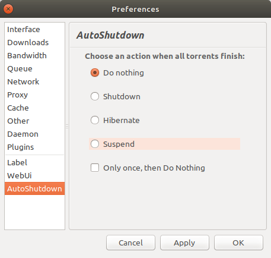

# Deluge Autoshutdown Plugin

A Deluge plugin to perform shutdown actions (shutdown, hibernate or standby)
when all torrents have completed downloading.

Homepage: https://github.com/cas--/autoshutdown/

## Download

Get the [latest release](https://github.com/cas--/autoshutdown/releases).

See [Deluge Plugins wiki] for install instructions.

## Installing from source code

Clone git or download the zip from https://github.com/cas--/autoshutdown

1. Build plugin egg

    python setup.py bdist_egg

1. Install plugin to deluge

    cp dist/AutoShutdown-0.1-py2.6.egg ~/.config/deluge/plugins

## Development

1. Go to plugin dir and run:

    ./create_dev_link.sh

1. Restart Deluge and the plugin should appear.

[Deluge Plugins wiki]: https://dev.deluge-torrent.org/wiki/Plugins#InstallingPluginEggs
